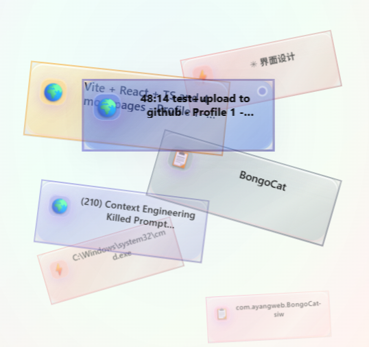
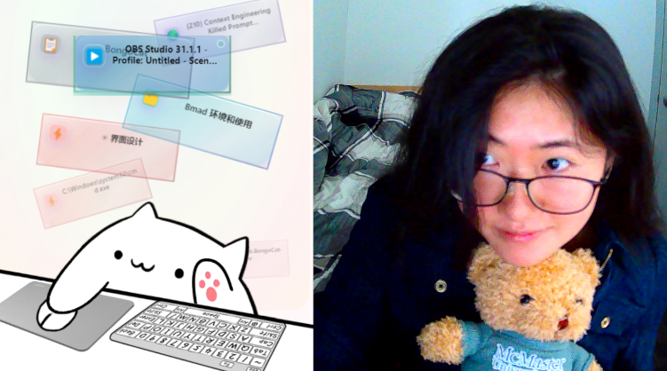

# Real-Time Window Visualizer 🪟✨

A beautiful real-time window detection and visualization system designed for OBS streaming and screen recording. Built with modern Python backend and React frontend architecture, featuring an elegant and sophisticated interface.

## 🖼️ Preview

### Web Interface Demo


### OBS Source Effect Demo  


## ✨ Core Features

### 🎨 Modern Design
- **Premium Color System** - 8 carefully crafted theme colors (Rose Gold, Ocean Depth, Emerald Forest, etc.)
- **Multi-layered Visual Effects** - Glass morphism, shine effects, dynamic shadows
- **Responsive Layout** - Adapts to different screen sizes, optimized for narrow-tall scenarios

### 🔍 Intelligent App Recognition
- **Process-level Detection** - Dual identification through process names and window titles
- **Rich Icon Library** - Supports 30+ popular applications with dedicated icons
- **Dynamic Title Support** - Perfect support for Notion, ClickUp and other dynamic-title applications
- **Browser Enhancement** - Auto-detects Chrome, Edge, Firefox and their tab pages

### 🎯 Real-time Visualization
- **Artistic Staggered Layout** - Natural card scatter effects with rotation and scaling
- **History Weight Algorithm** - Recently used apps appear closer to center
- **Smooth Animations** - Fluid transitions during window switching
- **Active State Indicators** - Real-time highlighting of current active window

### 🛠️ Flexible Configuration
- **Custom Icon Mapping** - Browser console tools for manual app icon assignment
- **Local Storage Config** - Persistent personalized settings
- **Developer Friendly** - Provides debugging tools and API interfaces

## 🏗️ Project Structure

```
real-time-visualizer/
├── apps/
│   ├── frontend/          # React + Vite + TypeScript
│   │   ├── src/
│   │   │   ├── components/
│   │   │   │   ├── WindowCard.tsx     # Window card component
│   │   │   │   ├── StackLayout.tsx    # Stacking layout component
│   │   │   │   └── *.css             # Style files
│   │   │   └── App.tsx               # Main application
│   │   └── package.json
│   └── backend/           # Python window detection backend
│       ├── main.py                   # Main server file
│       └── requirements.txt          # Python dependencies
├── docs/                  # Documentation
└── package.json          # Monorepo configuration
```

## 🚀 Quick Start

### Prerequisites

- **Node.js**: >= 16.0.0
- **Python**: >= 3.8.0  
- **Windows OS**: Required (for window detection)
- **Git**: Version control

### 1. Clone and Install

```bash
git clone <repository-url>
cd real-time-visualizer
npm run install:all
```

### 2. Start Development Environment

Run frontend and backend concurrently:

```bash
npm run dev
```

Service addresses:
- **Frontend Interface**: http://localhost:5173
- **Backend Service**: WebSocket port 8765

### 3. Individual Startup

Frontend only:
```bash
npm run dev:frontend
```

Backend only:
```bash
npm run dev:backend
```

## 📋 Available Scripts

| Script | Description |
|--------|-------------|
| `npm run dev` | Start both frontend and backend development servers |
| `npm run dev:frontend` | Start React development server only |
| `npm run dev:backend` | Start Python backend only |
| `npm run install:all` | Install all dependencies |
| `npm run build` | Build for production |
| `npm run clean` | Clean all node_modules and build artifacts |

## 🎮 Usage Guide

### Basic Usage

1. **Start System**: Run `npm run dev`
2. **Open Interface**: Visit http://localhost:5173
3. **View Effect**: System displays all open windows in real-time
4. **Use in OBS**: Add "Browser Source", set URL to http://localhost:5173

### Advanced Configuration

#### Custom App Icons

Use in browser console:

```javascript
// Set icon for specific window
setWindowIcon("Your App Window Title", "🎯")

// View all custom mappings
listWindowMappings()

// Clear all mappings
clearWindowIcons()
```

#### Supported App Icons

| App | Icon | App | Icon |
|-----|------|-----|------|
| ClickUp | 🎯 | Notion | 🗂️ |
| Claude Code | 🔧 | Claude | 🤖 |
| ChatGPT | 🧠 | YouTube | 📺 |
| VS Code | 💻 | Discord | 💬 |
| Figma | 🎨 | Spotify | 🎵 |
| GitHub | 🐙 | Twitter/X | 🐦 |
| Instagram | 📷 | LinkedIn | 💼 |
| Reddit | 🔴 | Netflix | 🎬 |
| Twitch | 🎮 | Zoom | 📹 |
| Teams | 👥 | Slack | 💼 |
| ... | ... | More | ... |

## 🏛️ Technical Architecture

### Backend Tech Stack
- **Python 3.8+** - Main development language
- **pygetwindow** - Core window detection library
- **psutil** - Process information retrieval
- **pywin32** - Windows API support
- **websockets** - WebSocket server

### Frontend Tech Stack
- **React 18** - UI framework
- **TypeScript** - Type safety
- **Vite** - Build tool
- **CSS3** - Advanced styling effects

### Core Algorithms
- **Window Detection Algorithm** - Real-time system window change monitoring
- **Process Matching Algorithm** - Get process info through window handles
- **History Weight Algorithm** - Usage frequency-based layout optimization
- **Color Generation Algorithm** - Consistent hash-based theme color generation

## 🎨 Color Themes

The system features 8 carefully designed premium color themes:

1. **🌹 Deep Rose Gold** - Elegant and modern
2. **🌊 Ocean Depth** - Professional and calm
3. **💎 Emerald Forest** - Natural and balanced
4. **👑 Royal Purple** - Creative and luxurious
5. **🌅 Sunset Amber** - Warm and energetic
6. **⚡ Steel Gray** - Industrial and stable
7. **🔥 Crimson Fire** - Passionate and powerful
8. **🌙 Midnight Blue** - Mysterious and deep

Each theme includes:
- Multi-layered gradient backgrounds
- Coordinated border colors
- Dynamic shadow effects
- Accent color highlights

## 🎯 Project Status

- ✅ **Project Architecture** - Monorepo structure complete
- ✅ **Backend Core** - Python window detection and WebSocket service complete
- ✅ **Frontend Interface** - React real-time visualization interface complete
- ✅ **App Recognition** - Smart process detection and icon system complete
- ✅ **Visual Design** - Premium color schemes and animation effects complete
- ✅ **User Experience** - Responsive layout and interaction optimization complete

## 🔧 Development Workflow

1. **Environment Setup**: Run `npm run install:all`
2. **Development Debug**: Use `npm run dev` for concurrent development
3. **Feature Testing**: Individual modules can be tested separately
4. **Production Build**: Use `npm run build` for release builds

## 🚀 OBS Integration

### Setup Steps:
1. Start the visualizer: `npm run dev`
2. In OBS, add a "Browser Source"
3. Set URL to: `http://localhost:5173`
4. Adjust width/height as needed
5. The visualizer will display your open windows in real-time

### Recommended Settings:
- **Width**: 500-800px (adjustable based on your layout)
- **Height**: 600-900px (optimized for vertical stacking)
- **FPS**: 30 (sufficient for smooth window transitions)

## 🤝 Contributing

1. Fork the repository
2. Create a feature branch (`git checkout -b feature/AmazingFeature`)
3. Commit your changes (`git commit -m 'Add some AmazingFeature'`)
4. Push to the branch (`git push origin feature/AmazingFeature`)
5. Open a Pull Request

## 📄 License

This project is licensed under the MIT License - see the [LICENSE](LICENSE) file for details

## 🙏 Acknowledgments

- Thanks to all open source library contributors
- Special thanks to Claude Code for assistance during development
- Inspired by modern design principles and streaming community needs

## 🐛 Troubleshooting

### Common Issues:

**Backend not starting?**
- Ensure Python 3.8+ is installed
- Install dependencies: `cd apps/backend && pip install -r requirements.txt`

**No windows detected?**
- Windows OS is required for window detection
- Run as administrator if needed

**Icons not showing correctly?**
- Check browser console for errors
- Use custom icon mapping for specific applications

**Performance issues?**
- Reduce the number of visible windows in layout
- Check WebSocket connection stability

---

*Built for creators, making every stream more engaging* ✨
